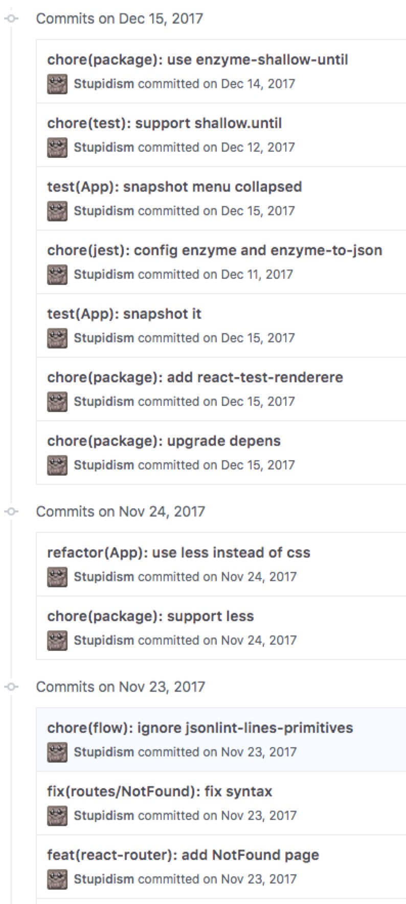

# Commit Message

我们采用业界比较通用的一套 commit message 规范: [AngularJS commit convention](https://docs.google.com/document/d/1QrDFcIiPjSLDn3EL15IJygNPiHORgU1_OOAqWjiDU5Y/edit#heading=h.7mqxm4jekyct), 对英文阅读有困难的可以看一下这篇[中文博客](http://www.ruanyifeng.com/blog/2016/01/commit_message_change_log.html)

## Convention

一般情况下一行 commit message 就够用了, 格式主要由 type, scope 和 subject 组成
```
<type>(<scope>): <subject>
```

- type: 类型, 如果发现难以找到合适的类型来形容, 可能意味着你需要拆分 commit, 可以是:
  - feat 功能变化, 广义上包括删除功能也是功能的变化
  - fix 修复 bug
  - docs 文档, 注释等
  - style 代码风格的修改, 如格式化, 尾逗号, 加空行等
  - refactor 不影响功能的, 代码结构上的改动
  - test 填加测试
  - chore 非业务代码的维护性改动, 比如依赖更新, 修改 scripts 等
 
- scope: 域, 可以是目录结构中的一个 name space, 也可以是任何其他的虚拟域, 下面举几个例子:
  - package 一般专指 package.json
  - routes/NotFound 一个 route component
  - README 一般专指 README.md

- subject: 主题, 一句话形容所做的修改, 可以自由发挥,

第一行的总长度不能超过72

如果一行写不下, 可以尝试拆分多一些 commit, 或者使用多行 message:

```
<type>(<scope>): <subject>
<BLANK LINE>
<body>
<BLANK LINE>
<footer>
```

## Lint

我们使用 husky 的 [commit-msg hook](https://github.com/typicode/husky/blob/master/HOOKS.md#hooks) 调用 [commitlint](http://marionebl.github.io/commitlint/#/) 来校验 message 是否符合格式

## Examples

<p align="center">
  
</p>


